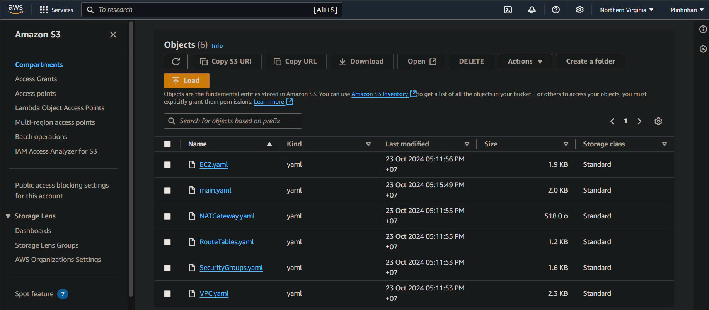
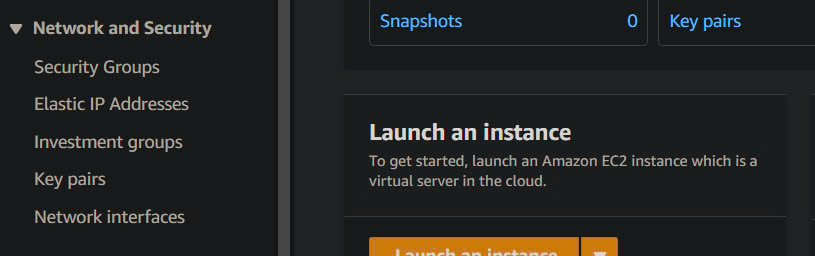
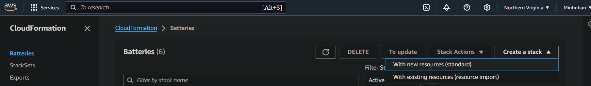

# LAB1 CLOUDFORMATION

1. Clone project về máy
    ```` terminal
    git clone https://github.com/Andrew-itsme/NT548-CongNgheDevOpsVaUngDung.git
    ````

2. Upload templates lên S3 Bucket
    ````
  
    ````

3. Tạo keypair cho EC2
    Chọn Key Paris trong phần Network & Security
   ````
  
   ````

4. Tạo Stack
    Vào CloudFormation chọn create Stack ->> with new resources (standard)
   ````
  
   ````